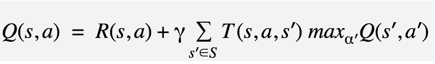
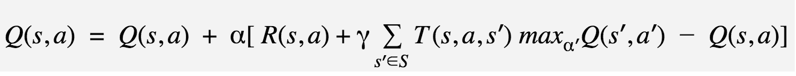
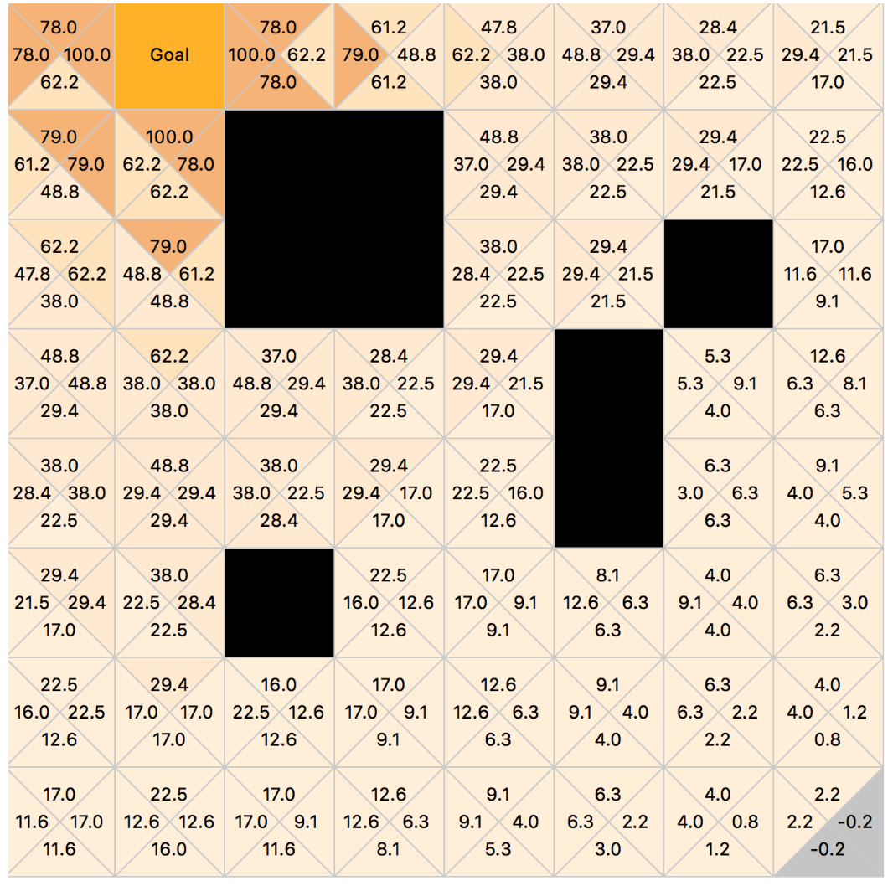
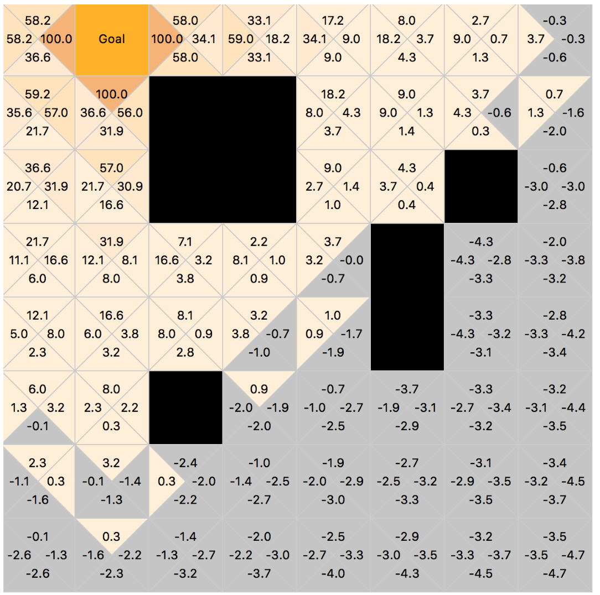
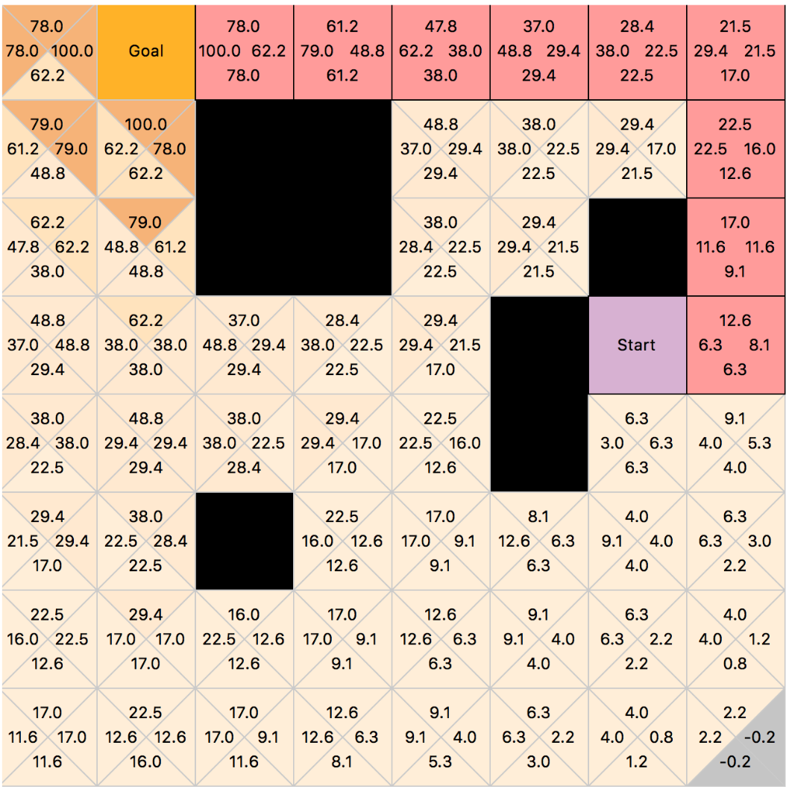
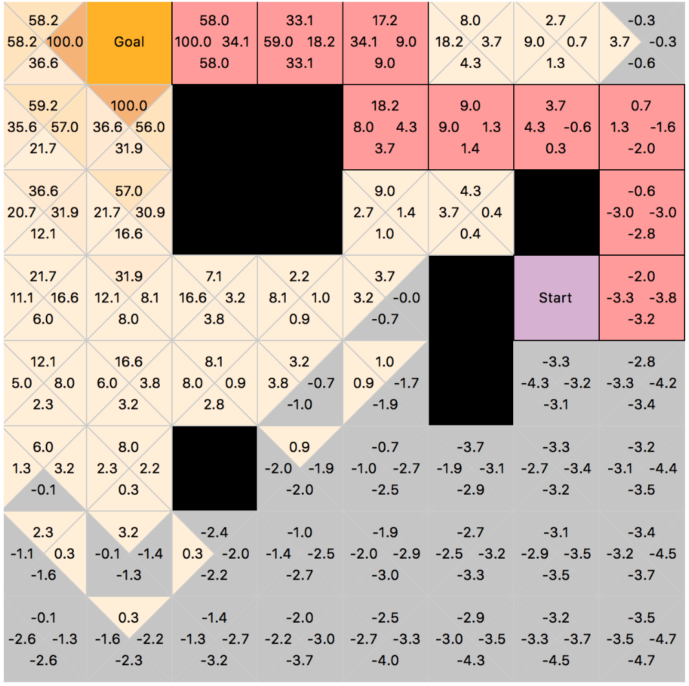
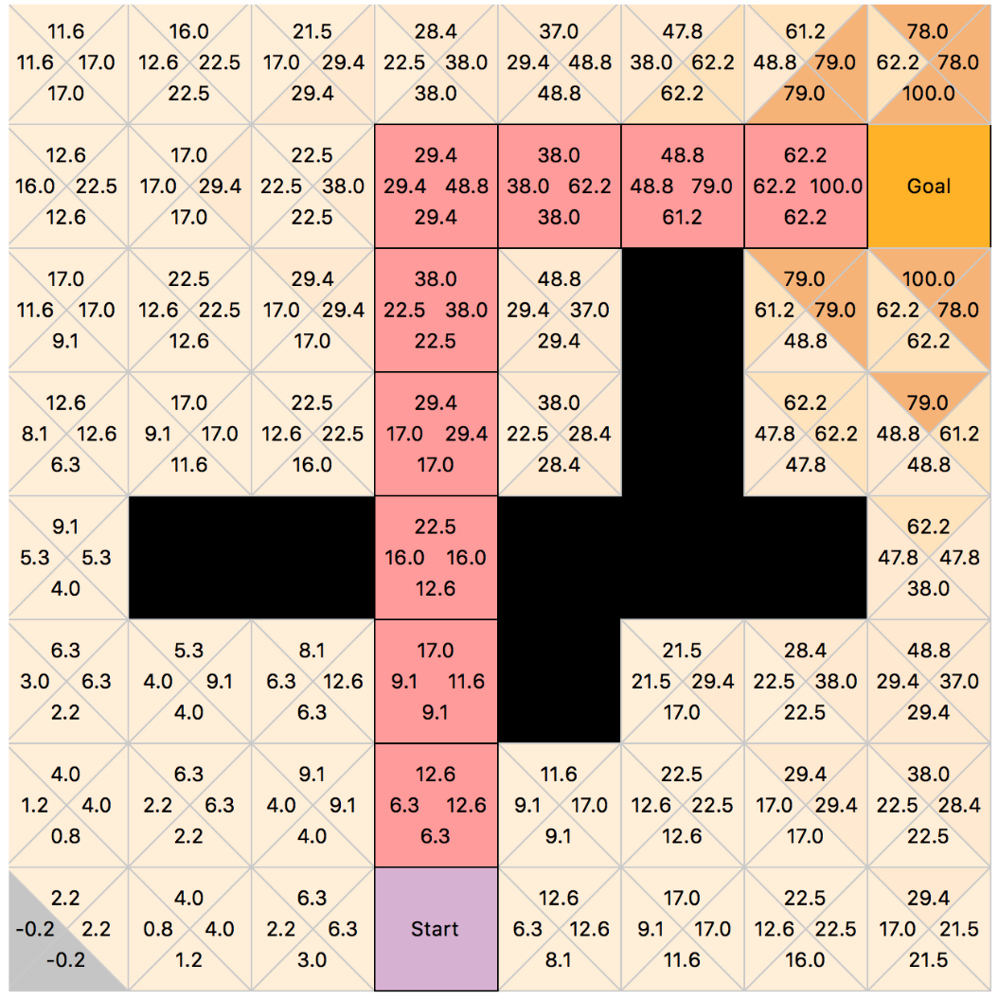
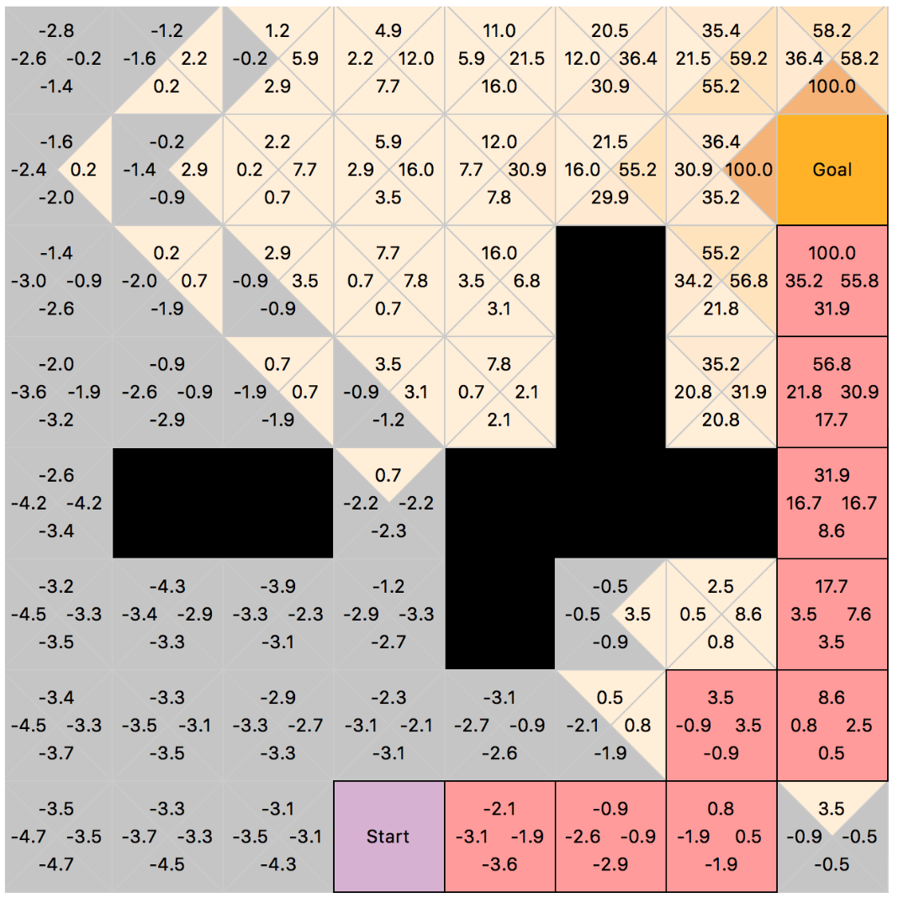

# Grid World

## The implementation of Q-Learning

The implementation was based on: 

the Q-Learning function (shown below) which calculates a new Q value of an action (a):

and the rule (shown below) which updates the old Q value in the learning process and controls the convergence to the optimal values after enough times of iterations:

  
  The parameter gamma (): is defined as the discount factor. can be in the range [0,1], where setting it closer to (0) will cause the planner agent to only consider immediate rewards. On the other hand, if it is set closer to (1) the planner agent will delay getting rewards and looks forward for higher rewards in the future. In this implementation the value of initially is set to (0.8), however it is possible to change it before the execution.
The parameter alpha (): is defined as the learning rate, which can be between [0,1]. Setting it (0) means that the Q-values will not be updated, and on the other side setting it to be (1) will make the learning progress happening very quick. In this implementation, initially, the alpha value is set to (1) and always can be changed before the execution.

The reward function R(s,a): will be called upon each action (a) from the state (s). In this implementation the planner agent will receive the high reward of (100) if it reaches the goal location. Moving to any other valid location (not obstacle and not goal) will give the agent a reward of (-1). Also by hitting the walls or obstacles, the agent will receive the reward of (-2). 

The transition function T(s,a,s’): is returning the probability of taking an action (a) and going to the next state (s’) from the current state (s). In our implementation, when the stochastic learning is executing the agent moves to the location (s’) from the current location (s) with the probability of (0.6) while the probability of other moves or staying at the same location is (0.1) .

The used explorations (selection) policies: In this implementation there are two different exploration (action selection) policies that the planner agent can take:
Softmax policy : this selection will bias towards promising actions that have higher rewards, which means the worst actions are not going to be selected. The most used softmax policy uses Boltzmann distribution.
-greedy policy : this selection policy is dependant on the probability value of epsilon (). If the epsilon value is chosen closer to (0) it means that the planner agent will more likely move to the next state by taking an optimum action. If the epsilon was closer to (1) the taken action will be more likely random than optimum, which means the agent will keep moving to the next location regardless of the action with higher reward. 

Another training parameters in our implementation are: 
The maximum number of episodes = 1000 iterations. However, the user is always able to pause on a specific episode and see the results on the grid.
The length of each episode = 150 steps, after which the current episode will be terminated and the next one will start.

Heatmaps of the final Q-tables (post-learning):
Note that the colors are showing the rewards, the lower the reward is the lighter the colors are. For the negative rewards the colors remain gray.
As we can see in the two figures below, the first one was generated after executing the Q-learning considering the softmax policy and the second one was generated using the e-greedy policy. In the softmax policy one, we can notice that the evaluated Q(s,a) have higher calculated rewards in comparison to the e-greedy one :

### Softmax Policy :

### e-greedy policy :

## Example 1:
### Softmax Policy :

### e-greedy policy :

## Example 2:

### Softmax Policy :

### e-greedy policy :

## Demo

- [A* path planner](https://www.youtube.com/watch?v=YRG1AzyKOsY&feature=youtu.be)

- [Q-Learning path planner](https://www.youtube.com/watch?v=9SC1HVWXTP4&feature=youtu.be)
